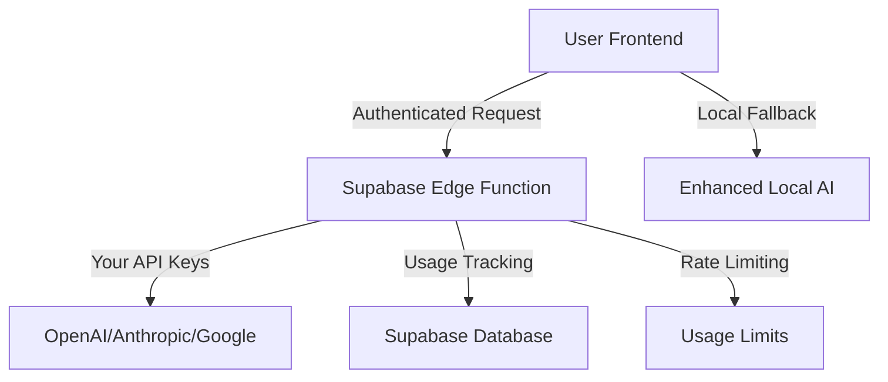

# AI Implementation Guide for Ottokode

## Overview

This guide explains how we've implemented a secure, user-friendly AI system that provides both free local AI and premium provider access without exposing API keys to users.

## Architecture

### 🔐 Secure AI Proxy System

**Problem Solved**: Users wanted AI features without requiring their own API keys.

**Solution**: Supabase Edge Functions as secure AI proxies with server-side key management.



### 🎯 Key Features

1. **Free Tier with Enhanced Local AI**
   - Smart pattern-based responses
   - Code examples and best practices
   - No API keys required
   - Perfect for beginners

2. **Premium Tier with Real AI**
   - OpenAI, Anthropic, Google AI access
   - Your API keys stored securely server-side
   - Usage tracking and limits
   - Advanced features

3. **Security & Privacy**
   - API keys never exposed to frontend
   - User authentication required for premium
   - Row-level security (RLS) in database
   - Rate limiting and cost controls

## Implementation Details

### 1. Supabase Edge Function (`supabase/functions/ai-chat/index.ts`)

**What it does:**
- Acts as secure proxy between frontend and AI providers
- Manages API keys server-side
- Implements usage tracking and limits
- Provides enhanced local AI responses

**Key features:**
- ✅ Authentication verification
- ✅ Usage limits (50k tokens/day, $1/day for free tier)
- ✅ Multi-provider support (OpenAI, Anthropic, Google)
- ✅ Enhanced local AI responses
- ✅ Cost tracking and analytics

### 2. Secure AI Service (`src/services/ai/SecureAIService.ts`)

**Frontend service that:**
- Communicates with Edge Function
- Handles authentication
- Manages usage limits display
- Provides error handling

### 3. Enhanced Local AI Provider (`src/services/ai/providers/LocalAIProvider.ts`)

**Smart local AI that provides:**
- Context-aware responses
- Code examples for popular frameworks
- Programming best practices
- Intelligent pattern matching

### 4. Updated UI Components

**Enhanced chat interface with:**
- Authentication status display
- Usage limit indicators
- Provider selection (Free vs Premium)
- Smart error messages

## Setup Instructions

### 1. Deploy the Edge Function

```bash
# Run the deployment script
./scripts/deploy-ai-service.sh
```

### 2. Configure API Keys in Supabase

1. Go to your Supabase dashboard
2. Navigate to Edge Functions > Secrets
3. Add your AI provider API keys:
   - `OPENAI_API_KEY`
   - `ANTHROPIC_API_KEY`
   - `GOOGLE_AI_API_KEY`

### 3. Update Environment Variables

```env
# Required
NEXT_PUBLIC_SUPABASE_URL=your-supabase-url
NEXT_PUBLIC_SUPABASE_ANON_KEY=your-anon-key

# Optional - for local development only
NEXT_PUBLIC_OPENAI_API_KEY=for-local-dev-only
NEXT_PUBLIC_ANTHROPIC_API_KEY=for-local-dev-only
```

### 4. Database Setup

The deployment script automatically creates:
- User management tables
- AI usage tracking
- Cost monitoring
- Row-level security policies

## Usage Scenarios

### Scenario 1: New User (No Account)
- **Experience**: Free Ottokode AI assistant
- **Features**: Basic coding help, examples, best practices
- **Limitations**: No usage tracking, simplified responses
- **Call-to-action**: Sign up for premium features

### Scenario 2: Authenticated User (Free Tier)
- **Experience**: Free Ottokode AI + premium AI with limits
- **Features**: 50k tokens/day, $1 cost limit, usage tracking
- **Benefits**: Real AI responses, conversation history
- **Upgrade path**: Higher limits with paid plan

### Scenario 3: Premium User
- **Experience**: Full AI access with high limits
- **Features**: Unlimited tokens, priority access, advanced features
- **Benefits**: Best possible AI experience

## Cost Management

### Free Tier Limits
```typescript
const FREE_TIER_LIMITS = {
  dailyTokenLimit: 50000,      // 50k tokens per day
  dailyCostLimit: 1.00,        // $1 per day maximum
  rateLimitRpm: 60,            // 60 requests per minute
  maxConversations: 10         // 10 conversations stored
}
```

### Cost Tracking
- Real-time usage monitoring
- Daily/monthly analytics
- Cost alerts and warnings
- Usage history and trends

## Security Features

### 1. API Key Protection
- ✅ Keys stored as Supabase secrets
- ✅ Never exposed to frontend
- ✅ Encrypted at rest
- ✅ Rotatable without code changes

### 2. Authentication & Authorization
- ✅ Supabase Auth integration
- ✅ JWT token validation
- ✅ Row-level security policies
- ✅ User isolation

### 3. Rate Limiting & Abuse Prevention
- ✅ Per-user daily limits
- ✅ Cost threshold monitoring
- ✅ Request rate limiting
- ✅ Suspicious activity detection

## Monitoring & Analytics

### Usage Tracking
```sql
-- Example: Get user's daily usage
SELECT
  provider,
  model,
  SUM(total_tokens) as total_tokens,
  SUM(cost) as total_cost,
  COUNT(*) as request_count
FROM ai_usage_records
WHERE user_id = $1
  AND created_at >= CURRENT_DATE
GROUP BY provider, model;
```

### Cost Analytics
- Daily/monthly cost breakdowns
- Provider comparison
- Usage trends and patterns
- Cost optimization suggestions

## Troubleshooting

### Common Issues

1. **"Authentication required" error**
   - User needs to sign in
   - Check Supabase auth configuration

2. **"Usage limit exceeded" error**
   - User hit daily limits
   - Show upgrade options
   - Reset at midnight UTC

3. **"Provider not configured" error**
   - API keys not set in Supabase secrets
   - Check Edge Function deployment

### Debug Commands

```bash
# Check Edge Function logs
supabase functions logs ai-chat

# Test Edge Function locally
supabase functions serve ai-chat

# Check database connectivity
supabase db ping
```

## Performance Optimization

### Edge Function Optimizations
- Connection pooling for AI providers
- Response caching for common queries
- Efficient token counting
- Async usage logging

### Frontend Optimizations
- Debounced requests
- Local state management
- Progressive loading
- Error retry logic

## Future Enhancements

### Planned Features
1. **Streaming Responses**: Real-time token streaming
2. **Custom Models**: Fine-tuned models for coding
3. **Team Collaboration**: Shared conversations
4. **Advanced Analytics**: Detailed usage insights
5. **Plugin System**: Extensible AI providers

### Scaling Considerations
- Multi-region deployment
- Database partitioning
- Caching layers
- Load balancing

## API Reference

### Edge Function Endpoints

```typescript
// POST /functions/v1/ai-chat
interface AIRequest {
  provider: 'openai' | 'anthropic' | 'google' | 'local'
  model: string
  messages: AIMessage[]
  options?: {
    maxTokens?: number
    temperature?: number
    stream?: boolean
  }
}

interface AIResponse {
  role: 'assistant'
  content: string
  timestamp: Date
  tokens?: number
  cost?: number
  provider: string
}
```

### Frontend Service Methods

```typescript
// SecureAIService methods
secureAIService.chat(request: SecureAIRequest): Promise<SecureAIResponse>
secureAIService.getUsageLimits(): Promise<UsageLimits>
secureAIService.getUsageHistory(days: number): Promise<UsageRecord[]>
secureAIService.isAuthenticated(): Promise<boolean>
```

## Conclusion

This implementation provides a robust, secure, and user-friendly AI system that:

- ✅ **Works out-of-the-box** with free local AI
- ✅ **Scales to premium features** with authentication
- ✅ **Protects your API keys** with server-side management
- ✅ **Tracks usage and costs** automatically
- ✅ **Provides great UX** with smart error handling
- ✅ **Maintains security** with proper authentication

Users get immediate value without setup, while you maintain control over costs and security.