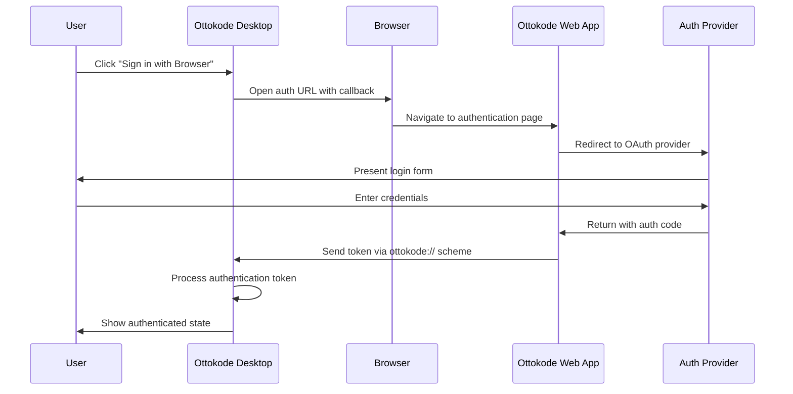

# 🔐 Ottokode Desktop Authentication Flow

This document describes the industry-standard authentication flow implemented in Ottokode Desktop, following patterns used by Cursor, Windsurf, and other leading AI development tools.

## 🎯 Overview

**Previous Flow (Non-Standard):**
- ❌ Desktop app had built-in sign-in/sign-up forms
- ❌ Users could create accounts directly in desktop app
- ❌ OAuth flows redirected to desktop app
- ❌ Confusing user experience with multiple auth points

**New Flow (Industry Standard):**
- ✅ Desktop app redirects to web browser for authentication
- ✅ All account creation and management happens on website
- ✅ Browser completes OAuth flows securely
- ✅ Desktop app receives authentication token via callback
- ✅ Seamless handoff between web and desktop

## 🏗️ Architecture

### Components

1. **DesktopAuthHandler** (`src/services/auth/DesktopAuthHandler.ts`)
   - Manages desktop-specific authentication logic
   - Handles browser redirects and token callbacks
   - Provides fallback manual token authentication

2. **DesktopAuthScreen** (`src/components/auth/DesktopAuthScreen.tsx`)
   - Modern authentication UI matching industry standards
   - Cursor/Windsurf-inspired design and flow
   - Support for both browser-based and token-based auth

3. **Web Authentication Callback** (`web-auth-callback.html`)
   - Web page that handles authentication completion
   - Communicates with desktop app via custom URL scheme
   - Provides fallback manual token method

### Authentication Flow Sequence



## 🚀 Implementation Details

### URL Schemes

The desktop app registers the `ottokode://` URL scheme to receive authentication callbacks:

- `ottokode://auth/callback?access_token=...&session_id=...`
- `ottokode://open` - Opens the desktop app

### Web App Integration

Your web app (ottokode.com) needs these endpoints:

1. **Authentication Initiation**
   ```
   GET /auth/desktop?desktop_auth=true&session_id=xxx&redirect_uri=ottokode://auth/callback
   ```

2. **Token Validation**
   ```
   POST /auth/token
   {
     "token": "access_token_here"
   }
   ```

3. **Polling for Auth Completion**
   ```
   GET /api/auth/desktop/poll/{sessionId}
   ```

### Configuration

Desktop app configuration in `DesktopAuthHandler.ts`:

```typescript
const desktopAuthConfig: DesktopAuthConfig = {
  webAppUrl: 'https://ottokode.com',
  redirectScheme: 'ottokode',
  authEndpoint: '/auth/desktop',
  tokenEndpoint: '/auth/token'
};
```

## 🎨 User Experience

### Primary Flow: Browser Authentication

1. User clicks "Sign in with Browser" in desktop app
2. Browser opens to ottokode.com authentication page
3. User signs in (or creates account) on website
4. Website redirects back to desktop app with token
5. Desktop app automatically authenticates user

### Fallback Flow: Manual Token

1. User clicks "Sign in with Token" in desktop app
2. User navigates to ottokode.com/auth/token in browser
3. Website displays authentication token
4. User copies token back to desktop app
5. Desktop app validates token and authenticates

## 🔒 Security Considerations

- **No credentials stored in desktop app** - All sensitive auth data stays in browser
- **Secure token transmission** - Tokens passed via registered URL schemes
- **Token expiration** - Short-lived access tokens with refresh capability
- **Fallback authentication** - Manual token input for network/redirect issues

## 📱 Platform Support

- **macOS**: Full support via custom URL scheme registration
- **Windows**: Full support via custom URL scheme registration
- **Linux**: Full support via custom URL scheme registration

## 🛠️ Development Setup

### Desktop App Changes

1. **Remove old Auth component**: `src/components/Auth.tsx` → `Auth.OLD.tsx`
2. **Add new auth components**: `src/components/auth/DesktopAuthScreen.tsx`
3. **Update App.tsx**: Use `DesktopAuthHandler` instead of `AuthService`
4. **Register URL scheme**: Configure `ottokode://` in Tauri config

### Web App Integration

1. **Deploy callback page**: Host `web-auth-callback.html` at your domain
2. **Add auth endpoints**: Implement desktop auth API endpoints
3. **Update OAuth config**: Add desktop redirect URIs
4. **Test authentication flow**: Verify browser → desktop handoff

## 🧪 Testing

### Local Development

1. Start desktop app in development mode
2. Configure web app URL to localhost:3000
3. Test browser authentication flow
4. Test manual token fallback
5. Verify authentication persistence

### Production Testing

1. Deploy web app with authentication endpoints
2. Test with production OAuth providers
3. Verify URL scheme registration works
4. Test across different operating systems
5. Verify token security and expiration

## 🐛 Troubleshooting

### Common Issues

1. **Browser doesn't redirect to desktop app**
   - Check URL scheme registration
   - Verify callback URL configuration
   - Use manual token method as fallback

2. **Authentication fails silently**
   - Check browser console for errors
   - Verify web app authentication endpoints
   - Test token validation API

3. **Token authentication fails**
   - Verify token format and encoding
   - Check token expiration
   - Test web app token generation

### Debug Mode

Enable debug logging in `DesktopAuthHandler`:

```typescript
console.log('Desktop auth debug mode enabled');
```

## 📋 Migration Checklist

- [x] Remove old Auth.tsx component
- [x] Implement DesktopAuthHandler service
- [x] Create DesktopAuthScreen component
- [x] Update App.tsx integration
- [x] Create web authentication callback page
- [ ] Deploy web app authentication endpoints
- [ ] Configure URL scheme registration in Tauri
- [ ] Test complete authentication flow
- [ ] Update user documentation

## 🎯 Next Steps

1. **Deploy web authentication system** - Implement backend endpoints
2. **Configure URL scheme** - Register `ottokode://` in Tauri config
3. **Test authentication flow** - End-to-end testing
4. **Update documentation** - User-facing auth instructions
5. **Remove deprecated components** - Clean up old authentication code

This new authentication flow positions Ottokode Desktop as a professional, industry-standard development tool that follows established patterns users expect from modern AI coding platforms.